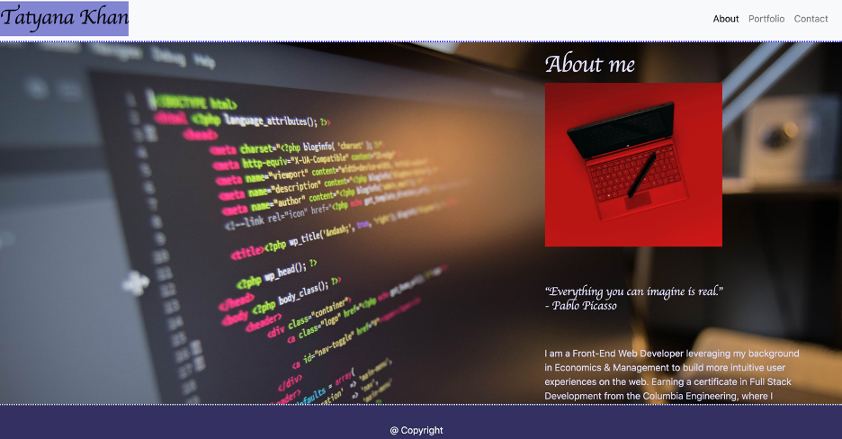

https://khantatyana.github.io/HW-Responsive-Portfolio/

# Unit 02 CSS and Bootstrap Homework: Responsive Portfolio

I used the Bootstrap CSS Framework to create a mobile responsive portfolio with 3 pages: `index.html`, `portfolio.html` and `contact.html`.
A navbar is included to each page. It contains links to Home/About, Contact (with links to social media), and Portfolio pages. All links work. I made a sticky footer and use sub-rows and sub-columns on my portfolio site, utilized Bootstrap components and grid system, used semantic html.

Plan:

1. Build the project
   - creating the folder
   - adding files
   - connecting files

2. Navbar
   - 3 links and a name

3. Portfolio
   - images
   - titles
   - descriptions
   - animations
   - javascript

4. About page
   - image
   - content

5. Contact page
   - Form with Name/Email/Message
   - social logo links

